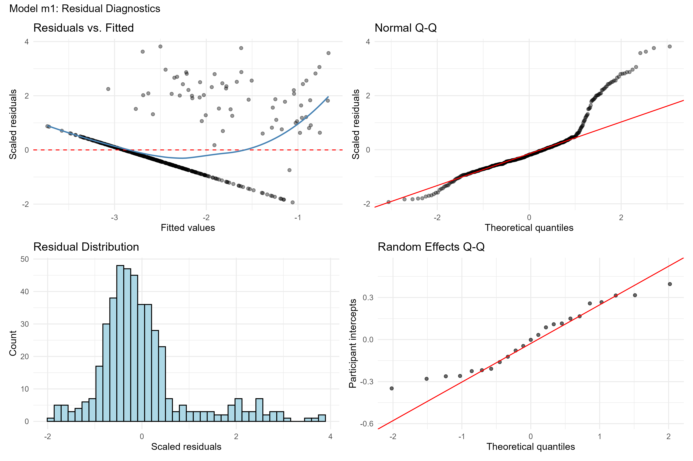
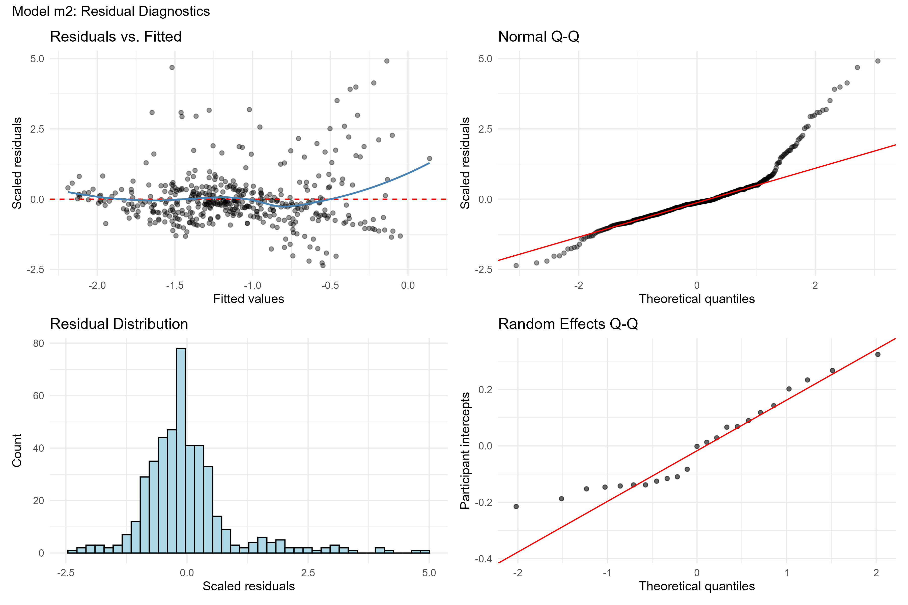
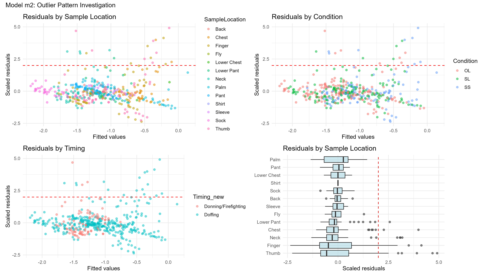

```{r}
#| label: setup
library(tidyverse)
library(lme4)
library(lmerTest)
library(emmeans)
library(patchwork)

setwd("C:/Users/vom8/dfse-fabric/")
```

# Introduction

This report summarizes the statistical analysis progress on the DFSE firefighter fabric study. The primary research question is whether polycyclic aromatic hydrocarbon (PAH) exposure — measured via fabric samples placed at various body locations — differs across experimental conditions, body locations, and sampling timing.

The dataset contains **448 measurements** from **23 firefighters** who participated in controlled burn exercises. Each firefighter contributed fabric samples from multiple body locations under different protective equipment conditions. The study used three conditions:

- **OL** — One-piece layer
- **SL** — Long-sleeve shirt and long pants
- **SS** — Short sleeve shirt and shorts

Samples were collected at two time points:

- **Donning/Firefighting** — during the activity
- **Doffing** — after the activity, when gear was removed

The exposure duration for each burn scenario was less than 20 minutes.

# Study Design Overview

Fabric samples were collected from up to 13 body locations per participant. The standard protocol locations included Back, Chest, Neck, Pant, Lower Pant, Sleeve, Sock, and glove locations (Finger, Thumb, Palm). A small number of ad hoc samples were also collected from Shirt (n=1), Lower Chest (n=2), and Fly (n=8) when visible contamination was noted at sample collection.

Each sample was analyzed for 15 individual PAHs. A limit of detection (LOD) was reported for each analyte in each sample. The total PAH concentration (`new_totalPAH`) was computed as the sum of all 15 PAH analytes.

A key challenge in these data is the high rate of non-detects: **384 of 448 observations (86%)** had a total PAH of zero, meaning none of the 15 individual PAHs were detected above their respective LODs.

```{r}
#| label: fig-nondetect-rate
#| fig-cap: "Distribution of total PAH detection across 448 fabric samples. The vast majority of samples had no detectable PAH above the limit of detection."
#| fig-width: 8
#| fig-height: 4

d <- readRDS("data/cleaned_data.RDS")

d |>
  mutate(detection = if_else(new_totalPAH > 0, "Detected", "Non-detect")) |>
  count(detection) |>
  mutate(pct = n / sum(n)) |>
  ggplot(aes(x = "", y = n, fill = detection)) +
  geom_col(width = 0.6) +
  geom_text(aes(label = paste0(n, " (", scales::percent(pct, accuracy = 0.1), ")")),
            position = position_stack(vjust = 0.5), size = 5, fontface = "bold") +
  scale_fill_manual(values = c("Detected" = "#009E73", "Non-detect" = "#CC79A7")) +
  coord_flip() +
  labs(x = NULL, y = "Number of Samples", fill = NULL,
       title = "Total PAH Detection Status") +
  theme_minimal(base_size = 13) +
  theme(
    legend.position = "top",
    axis.text.y = element_blank(),
    axis.ticks.y = element_blank()
  )
```

# Exploratory Data Analysis

Previous exploratory work (scripts `00e` through `00g`) established several findings:

- **Detection rates vary dramatically by body location.** Glove locations (Finger, Thumb, Palm) and Chest had the highest detection rates, while many body locations rarely showed detectable PAH.
- **Paper doll visualizations** showed that detected PAH tended to concentrate at the hands and upper torso, consistent with direct contact exposure during firefighting activities.
- **Detection rates vary by PAH analyte.** The top 6 most-frequently detected PAHs (in order) are: Dibenzo(a,h)anthracene, Benzo(b)fluoranthene, Indeno(1,2,3-cd)pyrene, Benzo(a)pyrene, Benzo(g,h,i)perylene, and Benzo(a)anthracene. This aligns with the Wilkinson et al. 2025 manuscript, which focused on gloves at Doffing.
- **The distribution of total PAH** is dominated by zeros with a long right tail among the detected values — a common pattern in environmental exposure data with short sampling durations.

# Handling Non-Detects: Beta-Substitution

## The Problem

When a PAH measurement falls below the limit of detection, it is reported as zero. However, this does not mean there was no exposure — it means the exposure was too low for the analytical method to quantify. Simply treating these as true zeros biases summary statistics downward and creates severe problems for statistical modeling (e.g., taking the logarithm of zero is undefined).

## The Beta-Substitution Approach

Beta-substitution replaces each non-detect with an estimated fraction of its limit of detection:

$$\text{Imputed value} = \hat{\beta} \times \text{LOD}$$

where $\hat{\beta}$ is a number between 0 and 1. A common naive approach sets $\hat{\beta}$ equal to the average ratio of detected values to their paired LODs. This was the method used in the previous analyses, and has been shown to work well when the non-detect rate is not too high. We developed an improved approach that estimates $\hat{\beta}$ using maximum likelihood estimation (MLE), assuming the underlying PAH concentrations follow a lognormal distribution. This approach was needed because the non-detect rate is extremely high (86%), which makes the naive average ratio method unreliable and biased toward zero.

Specifically, for each PAH analyte we:

1. Fit a censored lognormal distribution to the observed data using MLE (treating non-detects as left-censored at their LOD)
2. Estimated the distribution parameters ($\hat{\mu}$ and $\hat{\sigma}$ on the log scale)
3. Derived $\hat{\beta}$ as the expected value of the truncated distribution below the LOD, divided by the LOD

## Validation via Simulation

Before applying the MLE approach to the real data, we validated it using simulated data (script `00i`). We generated lognormal data with known parameters, artificially censored observations below a realistic LOD, and compared the naive and MLE beta estimates. The MLE approach recovered the true distributional parameters (geometric mean, geometric standard deviation, 95th percentile) more accurately than the naive approach, under a favorable censoring scenario (~30%).

## Application to the Top 6 PAHs

We applied MLE beta-substitution to each of the top 6 PAHs individually, then summed the imputed values to create a new composite exposure variable (`totalPAH_imputed`). The table below compares the original total PAH (all 15 analytes, no imputation), the raw top-6 sum (no imputation), and the imputed top-6 sum:

```{r}
#| label: comparison-table
comparison <- readRDS("03_output/comparison_table.rds")
knitr::kable(
  comparison,
  digits = 3,
  col.names = c("Version", "N Zeros", "Min", "Median", "Mean", "Max"),
  caption = "Comparison of total PAH variables"
)
```

After imputation, all 448 observations have positive values, enabling direct log-transformation without the need for an arbitrary constant.

**Important note:** The imputed composite sums only the top 6 PAHs, while the original `new_totalPAH` summed all 15. Some of those 15 analytes had an overall sum of 0, so it makes sense not to include them. The top 6 capture approximately 90% of the total PAH signal at the highest exposure levels, but location-specific signals from less-detected PAHs may be missed.

# Baseline Model (m1): Log-Transformed Total PAH with Zeros

## Model Specification

As a starting point, we fit a linear mixed-effects model to the original total PAH (all 15 analytes), using a log transformation with a small constant to handle the 384 zeros:

$$\log(\text{new\_totalPAH} + c) = \beta_0 + \beta_1 \cdot \text{Condition} + \beta_2 \cdot \text{Timing} + \beta_3 \cdot \text{Location} + u_{\text{participant}} + \varepsilon$$

where $c$ = half the minimum non-zero value, $u_{\text{participant}} \sim N(0, \sigma^2_u)$ is a random intercept for each firefighter, and $\varepsilon \sim N(0, \sigma^2)$ is the residual error.

## Results

All three fixed effects were statistically significant:

- **Sample Location** (F = 10.8, p < 0.001) — the dominant effect, driven by elevated PAH at glove locations
- **Timing** (F = 71.4, p < 0.001) — Doffing samples were substantially higher than Donning/Firefighting
- **Condition** (F = 5.8, p = 0.003) — differences between protective equipment conditions were detectable

The intraclass correlation (ICC) was approximately **8.5%**, indicating that the majority of variation in PAH exposure is driven by within-participant factors (location, timing, condition) rather than between-participant differences.

Pairwise contrasts for Condition (Tukey-adjusted) showed:

- **SS vs. OL:** statistically significant (p = 0.002) — SS had higher exposure
- **SS vs. SL:** not significant (p = 0.15)
- **SL vs. OL:** not significant (p = 0.13)

## Model Diagnostics

```{r}
#| label: fig-m1-diagnostics
#| fig-cap: "Model m1 residual diagnostics. The bimodal pattern in the residuals vs. fitted plot (top left) reflects the dominance of zeros in the data. The Q-Q plot (top right) shows severe departures from normality in both tails."
#| fig-width: 10
#| fig-height: 7

```

The diagnostic plots reveal fundamental problems with this model:

1. **Residuals vs. Fitted:** Two distinct clusters are visible — a dense band of zero-origin observations and a scattered cloud of positive values. The model is attempting to fit two different data-generating processes with a single continuous regression.
2. **Q-Q Plot:** Severe departures from normality in both tails, particularly the right tail.
3. **Residual histogram:** The residuals are bimodal, reflecting the zero-inflation.
4. **Random effects Q-Q:** The participant-level intercepts show heavier tails than expected under normality.

**Interpretation:** This model violates the assumptions of normality, homoscedasticity, and normal random effects. The results should be treated as qualitative indicators of effect direction and relative magnitude, not as reliable inferential statistics. The strong signals for Location, Timing, and Condition are encouraging — they suggest real effects that survive despite the model misspecification — but the exact p-values and estimates are unreliable.

# Improved Model (m2): MLE-Imputed Total PAH

## Model Specification

After applying MLE beta-substitution to the top 6 PAHs and summing the imputed values, all observations are positive. The improved model uses a direct log transformation without a constant:

$$\log(\text{totalPAH\_imputed}) = \beta_0 + \beta_1 \cdot \text{Condition} + \beta_2 \cdot \text{Timing} + \beta_3 \cdot \text{Location} + u_{\text{participant}} + \varepsilon$$

## Results

```{r}
#| label: m2-variance
vc2 <- readRDS("03_output/m2_variance_components.rds")
icc2 <- readRDS("03_output/m2_icc.rds")

vc_tbl <- tibble(
  Component = c("Participant", "Residual"),
  Variance  = vc2$vcov,
  `Std. Dev.` = vc2$sdcor,
  ICC = c(scales::percent(icc2, accuracy = 0.1), "—")
)
knitr::kable(vc_tbl, digits = 3, caption = "Model m2: Variance components")
```

The ICC increased from 8.5% (m1) to approximately **11%** (m2). This makes sense: the imputation removed artificial variance caused by the zero-spike, so the remaining variability better reflects the true data structure. A greater share of the remaining variation is now attributable to participant-level differences.

All three fixed effects remain statistically significant, and the Condition effect strengthened:

- **Sample Location** (p < 0.001) — glove locations (Palm, Finger, Thumb) remain the highest
- **Timing** (p < 0.001) — Doffing remains substantially elevated
- **Condition** (p < 0.001) — the signal is stronger after imputation

Pairwise contrasts for Condition:

```{r}
#| label: m2-contrasts
emm2 <- readRDS("03_output/m2_emmeans_condition.rds")
contr2 <- contrast(emm2, method = "pairwise", adjust = "tukey")
knitr::kable(
  as.data.frame(contr2),
  digits = 3,
  caption = "Model m2: Pairwise condition contrasts (Tukey-adjusted)"
)
```

- **SS vs. OL:** statistically significant (p < 0.001) — SS had higher PAH exposure
- **SL vs. SS:** statistically significant (p = 0.045) — SS higher than SL
- **OL vs. SL:** not significant (p = 0.098)

The estimated marginal means on the log scale follow the ordering **OL < SL < SS**, indicating a gradient of increasing PAH exposure as protective equipment decreases.

## Model Diagnostics

```{r}
#| label: fig-m2-diagnostics
#| fig-cap: "Model m2 residual diagnostics. The bimodal pattern is eliminated, though a heavy right tail persists in the Q-Q plot."
#| fig-width: 10
#| fig-height: 7

```

The diagnostics show substantial improvement over m1:

1. **Residuals vs. Fitted:** The bimodal clustering is gone. The spread is roughly constant across the range of fitted values, with a slight uptick on the right.
2. **Q-Q Plot:** The left tail is well-behaved. The right tail (above theoretical quantile +1) still departs from normality — a subset of high-exposure observations that the lognormal model underestimates.
3. **Residual histogram:** Unimodal and roughly symmetric with a right skew — a major improvement.
4. **Random effects Q-Q:** The S-shape is more pronounced than in m1, suggesting some participants are consistently higher or lower than the normal random effect can accommodate.

# Quality Check: Investigating the Heavy Right Tail

To understand the 20 observations with unusually large positive residuals (scaled residual > 2), we examined their characteristics:

```{r}
#| label: fig-outlier-patterns
#| fig-cap: "Residual patterns by sample location, condition, and timing. The boxplot (bottom right) shows that glove locations produce the largest residuals."
#| fig-width: 12
#| fig-height: 7

```

Key findings:

- **Body location:** 65% of outliers are from Thumb (7) and Finger (6) — high-contact surfaces. Four outliers are from the Neck, which is notable as a non-contact location.
- **Timing:** 85% occur at Doffing — post-fire samples, when contamination is expected to be highest, but doffing is also the most common time point.
- **Condition:** Roughly proportional across all three conditions — no single condition drives the tail.
- **Participants:** 12 of 23 firefighters contribute at least one outlier — the pattern is dispersed rather than concentrated.
- **PAH detection:** The most extreme outliers have **all 6 PAHs simultaneously detected** — these are samples with broad, genuine contamination rather than a single anomalous analyte.

**Conclusion:** The heavy right tail represents real high-exposure events, primarily from glove contact during doffing. These are not data artifacts and should not be excluded. The model's lognormal assumption cannot fully accommodate the tail weight, which is a known limitation.

# Summary of Key Findings

```{r}
#| label: side-by-side
tibble(
  Metric = c("ICC", "Condition F-test p-value",
             "SS vs. OL p-value", "SS vs. SL p-value", "OL vs. SL p-value"),
  `Baseline (m1)` = c("8.5%", "0.003", "0.002", "0.15", "0.13"),
  `Improved (m2)` = c("10.9%", "< 0.001", "< 0.001", "0.045", "0.098")
) |>
  knitr::kable(caption = "Comparison of baseline and improved model results")
```

1. **The SS condition is associated with significantly higher PAH exposure** than both OL and SL. This finding is consistent across both models and strengthens after imputation.
2. **Timing matters:** Doffing samples show substantially higher PAH than Donning/Firefighting samples.
3. **Body location is the dominant source of variation.** Glove locations (Palm, Finger, Thumb) and upper body (Chest, Neck) show the highest PAH levels.
4. **Between-participant variation is modest** (~11% of total variance), meaning the exposure pattern is more about *where* and *when* than *who*.
5. **MLE beta-substitution substantially improved model diagnostics** by eliminating the bimodal residual structure caused by zero-inflation.

# Decision Points & Next Steps

Several analytical decisions were documented for future sensitivity analyses:

1. **PAH scope:** Only the top 6 most-detected PAHs are included in the imputed sum. Expanding to all 15 may recover signals at specific body locations (e.g., Lower Pant). Reducing to fewer PAHs (e.g., top 3) may yield a more robust composite with fewer imputation assumptions.
2. **LOD representation:** A single median LOD per PAH was used for the MLE derivation. Per-sample LODs could be explored.
3. **Distributional assumption:** Lognormal was assumed for each PAH. Alternatives (gamma, Weibull) could be tested.
4. **Ad hoc sample locations:** Shirt (n=1), Lower Chest (n=2), and Fly (n=8) were collected under different criteria than the standard protocol. These may need to be collapsed into broader groups or excluded. It may make sense to collapse other sample locations into broader categories (e.g., all gloves together) to reduce model complexity and improve stability.
5. **Heterogeneous variance:** The boxplot of residuals by body location suggests that variance differs across locations. Allowing location-specific residual variances (e.g., via `nlme::lme`) may improve the model.
6. **Heavy right tail:** The 20 high-residual observations are legitimate but challenge the normality assumption. Robust mixed models or alternative distributional families (gamma GLMM) could be explored.
